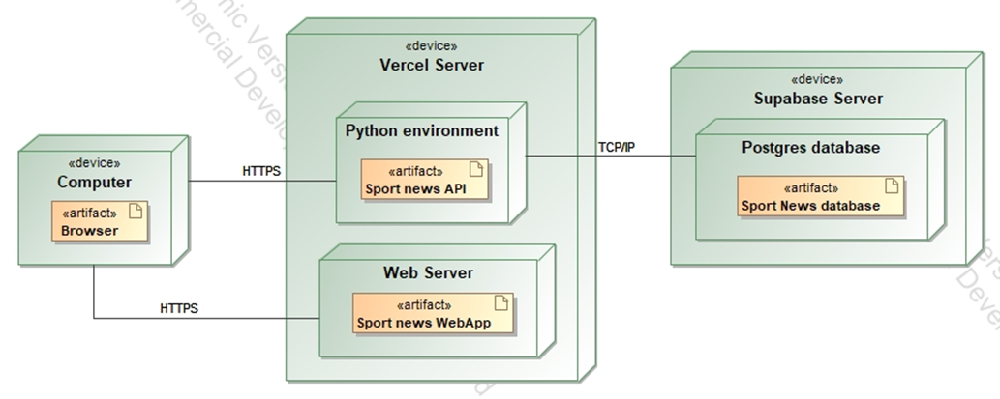

# Sistemos paskirtis

Šio projekto tikslas yra leisti vartotojams stebėti įvairias naujienas susijusias su sportu bei dalintis jomis. 

Veikimo principas – pačią kuriamą platformą sudaro dvi dalys: internetinė aplikacija, kuria naudosis vartotojai, redaktoriai, administratorius bei aplikacijų programavimo sąsaja 

Neprisijungęs vartotojas galės peržiūrėti naujienas, bei galės prisijungti ir prisiregistruoti. Prisijungęs vartotojas galės peržiūrėti naujienas, kurti jas, bei savąsias redaguoti ir trinti. Redaktoriai galės pridėti, trinti, redaguoti kategorijas, kur bus pridėdamos naujienos, taip pat galės pridėti, trinti, redaguoti naujienas. Administratoriai valdo vartotojus. 

# Funkciniai reikalavimai

Neprisijungęs vartotojas:
- Prisijungti
- Registruotis
- Peržiūrėti naujienas

Prisijungęs vartotojas:
- Atsijungti
- Peržiurėti naujienas
- Kurti naujienas
- Redaguoti savo naujienas
- Trinti savo naujienas

Redaktorius:
- Valdyti kategorijas
- Valdyti naujienas

Administratorius:
- Valdyti vartotojus

# Sistemos architektūra

Sistemos sudedamosios dalys:
• Kliento pusė realizuota naudojant React
• Serverio pusė realizuota naudojant Python Django, o duomenų bazei bus naudojama Postgres

